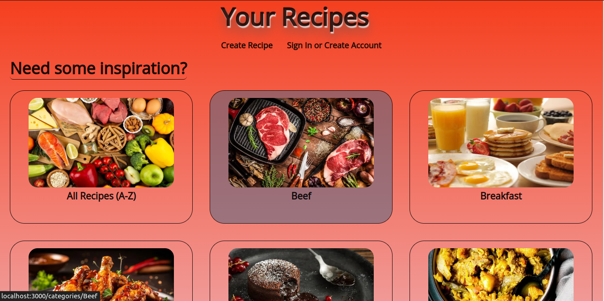
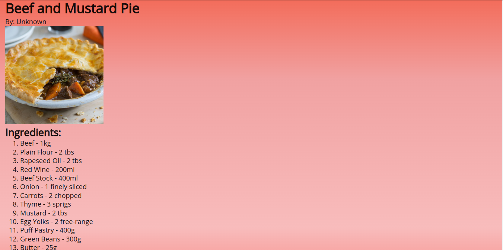

# your-recipes

A Recipes WebSite has a backend implementation for a recipe management system. It provides APIs for user authentication, recipe retrieval, creation, saving, and removal. The backend is built using Node.js, Express, and MongoDB. Its backend is built with React. The application allows users to explore recipes, view details, and manage their saved recipes.
This Web Application uses the MERN stack (MongoDB, Express.js, React.js, Node.js).

Main page:

Recipe page:
